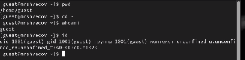

# Содержание {#содержание .TOC-Heading}

[1 Цель работы [1](#цель-работы)](#цель-работы)

[2 Задание [1](#задание)](#задание)

[3 Теоретическое введение
[1](#теоретическое-введение)](#теоретическое-введение)

[4 Выполнение лабораторной работы
[2](#выполнение-лабораторной-работы)](#выполнение-лабораторной-работы)

[4.1 Атрибуты файлов [2](#атрибуты-файлов)](#атрибуты-файлов)

[4.2 Заполнение таблицы 2.1
[5](#заполнение-таблицы-2.1)](#заполнение-таблицы-2.1)

[4.3 Заполнение таблицы 2.2
[8](#заполнение-таблицы-2.2)](#заполнение-таблицы-2.2)

[5 Выводы [8](#выводы)](#выводы)

[6 Список литературы. Библиография
[8](#список-литературы.-библиография)](#список-литературы.-библиография)

# 1 Цель работы

Получение практических навыков работы в консоли с атрибутами файлов,
закрепление теоретических основ дискреционного разграничения доступа в
современных системах с открытым кодом на базе ОС Linux

# 2 Задание

1.  Работа с атрибутами файлов
2.  Заполнение таблицы "Установленные права и разрешённые действия" (см.
    табл. 2.1)
3.  Заполнение таблицы "Минимальные права для совершения операций" (см.
    табл. 2.2)

# 3 Теоретическое введение

**Операционная система** --- это комплекс программ, предназначенных для
управления ресурсами компьютера и организации взаимодействия с
пользователем. \[1\]

**Права доступа** определяют, какие действия конкретный пользователь
может или не может совершать с определенным файлами и каталогами. С
помощью разрешений можно создать надежную среду --- такую, в которой
никто не может поменять содержимое ваших документов или повредить
системные файлы. \[2\].

# 4 Выполнение лабораторной работы

## 4.1 Атрибуты файлов

1.  В операционной системе Rocky создаю нового пользователя guest через
    учетную запись администратора (рис. 1).

{width="2.3854166666666665in"
height="0.2604166666666667in"}

Добавление пользователя

2.  Далее задаю пароль для созданной учетной записи (рис. 2).

{width="4.3125in" height="0.7916666666666666in"}

Добавление пароля для пользователя

3.  Сменяю пользователя в системе на только что созданного пользователя
    guest (рис. 3).

{width="6.728472222222222in"
height="4.309027777777778in"}

Вход через аккаунт пользователя

4.  Определяю с помощью команды pwd, что я нахожусь в директории
    /home/guest/. Эта директория является домашней, ведь в приглашении
    командой строкой стоит значок \~, указывающий, что я в домашней
    директории (рис. 4).

{width="4.3125in" height="1.0625in"}

Текущая директория

5.  Уточняю имя пользователя (рис. 5)

{width="1.7083333333333333in"
height="0.3854166666666667in"}

Информация об имени пользователе

6.  В выводе команды groups информация только о названии группы, к
    которой относится пользователь. В выводе команды id можно найти
    больше информации: имя пользователя и имя группы, также коды имени
    пользователя и группы (рис. 6)

{width="4.197916666666667in"
height="0.7916666666666666in"}

Информация о пользователе

7.  Имя пользователя в приглашении командной строкой совпадает с именем
    пользователя, которое выводит команда whoami (рис. 7)

{width="1.7083333333333333in"
height="0.3854166666666667in"}

Сравнение информации об имени пользователя

8.  Получаю информацию о пользователе с помощью команды

```{=html}
<!-- -->
```
    cat /etc/passwd | grep guest

В выводе получаю коды пользователя и группы, адрес домашней директории
(рис. 8).

{width="3.0in" height="0.2916666666666667in"}

Просмотр файла passwd

9.  Да, список поддиректорий директории home получилось получить с
    помощью команды ls -l, если мы добавим опцию -a, то сможем увидеть
    еще и директорию пользователя root. Права у директории:

root: drwxr-xr-x,

evdvorkina и guest: drwx------ (рис. 9).

{width="3.625in" height="1.4895833333333333in"}

Просмотр содержимого директории

10. Пытался проверить расширенные атрибуты директорий. Нет, их увидеть
    не удалось (рис. 10). Увидеть расширенные атрибуты других
    пользователей, тоже не удалось, для них даже вывода списка
    директорий не было.

{width="2.8229166666666665in"
height="1.1354166666666667in"}

Проверка расширенных атрибутов

11. Создаю поддиректорию dir1 для домашней директории. Расширенные
    атрибуты командой lsattr просмотреть у директории не удается, но
    атрибуты есть: drwxr-xr-x, их удалось просмотреть с помощью команды
    ls -l (рис. 11).

{width="4.291666666666667in"
height="3.0208333333333335in"}

Создание поддиректории

12. Снимаю атрибуты командой chmod 000 dir1, при проверке с помощью
    команды ls -l видно, что теперь атрибуты действительно сняты (рис.
    12).

{width="3.3333333333333335in" height="1.375in"}

Снятие атрибутов с директории

13. Попытка создать файл в директории dir1. Выдает ошибку: "Отказано в
    доступе" (рис. 13).

{width="3.625in" height="0.3020833333333333in"}

Попытка создания файла

Вернув права директории и использовав снова командy ls -l можно
убедиться, что файл не был создан (рис. 14).

{width="4.166666666666667in" height="0.8125in"}

Проверка содержимого директории

## 4.2 Заполнение таблицы 2.1

  ------------ --------- ---------- ---------- -------- -------- ------------ ------------ ------------ -----------
  Права        Права     Создание   Удаление   Запись в Чтение   Смена        Просмотр     Переимено-   Смена
  директории   файла     файла      файла      файл     файла    директории   файлов в     вание файла  атрибутов
                                                                              директории                файла

  d(000)       \(000\)   \-         \-         \-       \-       \-           \-           \-           \-

  d(000)       \(100\)   \-         \-         \-       \-       \-           \-           \-           \-

  d(000)       \(200\)   \-         \-         \-       \-       \-           \-           \-           \-

  d(000)       \(300\)   \-         \-         \-       \-       \-           \-           \-           \-

  d(000)       \(400\)   \-         \-         \-       \-       \-           \-           \-           \-

  d(000)       \(500\)   \-         \-         \-       \-       \-           \-           \-           \-

  d(000)       \(600\)   \-         \-         \-       \-       \-           \-           \-           \-

  d(000)       \(700\)   \-         \-         \-       \-       \-           \-           \-           \-

  d(100)       \(000\)   \-         \-         \-       \-       \+           \-           \-           \+

  d(100)       \(100\)   \-         \-         \-       \-       \+           \-           \-           \+

  d(100)       \(200\)   \-         \-         \+       \-       \+           \-           \-           \+

  d(100)       \(300\)   \-         \-         \+       \-       \+           \-           \-           \+

  d(100)       \(400\)   \-         \-         \-       \+       \+           \-           \-           \+

  d(100)       \(500\)   \-         \-         \-       \+       \+           \-           \-           \+

  d(100)       \(600\)   \-         \-         \+       \+       \+           \-           \-           \+

  d(100)       \(700\)   \-         \-         \+       \+       \+           \-           \-           \+

  d(200)       \(000\)   \-         \-         \-       \-       \-           \-           \-           \-

  d(200)       \(100\)   \-         \-         \-       \-       \-           \-           \-           \-

  d(200)       \(200\)   \-         \-         \-       \-       \-           \-           \-           \-

  d(200)       \(300\)   \-         \-         \-       \-       \-           \-           \-           \-

  d(200)       \(400\)   \-         \-         \-       \-       \-           \-           \-           \-

  d(200)       \(500\)   \-         \-         \-       \-       \-           \-           \-           \-

  d(200)       \(600\)   \-         \-         \-       \-       \-           \-           \-           \-

  d(200)       \(700\)   \-         \-         \-       \-       \-           \-           \-           \-

  d(300)       \(000\)   \+         \+         \-       \-       \+           \-           \+           \+

  d(300)       \(100\)   \+         \+         \-       \-       \+           \-           \+           \+

  d(300)       \(200\)   \+         \+         \+       \-       \+           \-           \+           \+

  d(300)       \(300\)   \+         \+         \+       \-       \+           \-           \+           \+

  d(300)       \(400\)   \+         \+         \-       \+       \+           \-           \+           \+

  d(300)       \(500\)   \+         \+         \-       \+       \+           \-           \+           \+

  d(300)       \(600\)   \+         \+         \+       \+       \+           \-           \+           \+

  d(300)       \(700\)   \+         \+         \+       \+       \+           \-           \+           \+

  d(400)       \(000\)   \-         \-         \-       \-       \-           \+           \-           \-

  d(400)       \(100\)   \-         \-         \-       \-       \-           \+           \-           \-

  d(400)       \(200\)   \-         \-         \-       \-       \-           \+           \-           \-

  d(400)       \(300\)   \-         \-         \-       \-       \-           \+           \-           \-

  d(400)       \(400\)   \-         \-         \-       \-       \-           \+           \-           \-

  d(400)       \(500\)   \-         \-         \-       \-       \-           \+           \-           \-

  d(400)       \(600\)   \-         \-         \-       \-       \-           \+           \-           \-

  d(400)       \(700\)   \-         \-         \-       \-       \-           \+           \-           \-

  d(500)       \(000\)   \-         \-         \-       \-       \+           \+           \-           \+

  d(500)       \(100\)   \-         \-         \-       \-       \+           \+           \-           \+

  d(500)       \(200\)   \-         \-         \+       \-       \+           \+           \-           \+

  d(500)       \(300\)   \-         \-         \+       \-       \+           \+           \-           \+

  d(500)       \(400\)   \-         \-         \-       \+       \+           \+           \-           \+

  d(500)       \(500\)   \-         \-         \-       \+       \+           \+           \-           \+

  d(500)       \(600\)   \-         \-         \+       \+       \+           \+           \-           \+

  d(500)       \(700\)   \-         \-         \+       \+       \+           \+           \-           \+

  d(600)       \(000\)   \-         \-         \-       \-       \-           \+           \-           \-

  d(600)       \(100\)   \-         \-         \-       \-       \-           \+           \-           \-

  d(600)       \(200\)   \-         \-         \-       \-       \-           \+           \-           \-

  d(600)       \(300\)   \-         \-         \-       \-       \-           \+           \-           \-

  d(600)       \(400\)   \-         \-         \-       \-       \-           \+           \-           \-

  d(600)       \(500\)   \-         \-         \-       \-       \-           \+           \-           \-

  d(600)       \(600\)   \-         \-         \-       \-       \-           \+           \-           \-

  d(600)       \(700\)   \-         \-         \-       \-       \-           \+           \-           \-

  d(700)       \(000\)   \+         \+         \-       \-       \+           \+           \+           \+

  d(700)       \(100\)   \+         \+         \-       \-       \+           \+           \+           \+

  d(700)       \(200\)   \+         \+         \+       \-       \+           \+           \+           \+

  d(700)       \(300\)   \+         \+         \+       \-       \+           \+           \+           \+

  d(700)       \(400\)   \+         \+         \-       \+       \+           \+           \+           \+

  d(700)       \(500\)   \+         \+         \-       \+       \+           \+           \+           \+

  d(700)       \(600\)   \+         \+         \+       \+       \+           \+           \+           \+

  d(700)       \(700\)   \+         \+         \+       \+       \+           \+           \+           \+
  ------------ --------- ---------- ---------- -------- -------- ------------ ------------ ------------ -----------

Таблица 2.1 «Установленные права и разрешённые действия»

Пример заполнения таблицы 2.1 (рис. 15).

{width="4.28125in"
height="2.9583333333333335in"}

Изменение прав директории и файла

## 4.3 Заполнение таблицы 2.2

  ---------------- -------------- -------------- -------------- --------------
  Операция                        Минимальные                   Минимальные
                                  права на                      права на файл
                                  директорию                    

  Создание файла                  d(300)                        \-

  Удаление файла                  d(300)                        \-

  Чтение файла                    d(100)                        \(400\)

  Запись в файл                   d(100)                        \(200\)

  Переименование                  d(300)                        \(000\)
  файла                                                         

  Создание                        d(300)                        \-
  поддиректории                                                 

  Удаление                        d(300)                        \-
  поддиректории                                                 
  ---------------- -------------- -------------- -------------- --------------

Таблица 2.2 "Минимальные права для совершения операций"

Пример заполнения таблицы 2.2 (рис. 16)

{width="3.65625in"
height="1.8645833333333333in"}

Проверка возможности создать поддиректорию

# 5 Выводы

Были получены практические навыки работы в консоли с атрибутами файлов,
закреплены теоретические основы дискреционного разграничения доступа в
современных системах с открытым кодом на базе ОС Linux.

# 6 Список литературы. Библиография

\[1\] Операционные системы:
https://blog.skillfactory.ru/glossary/operaczionnaya-sistema/

\[2\] Права доступа:
https://codechick.io/tutorials/unix-linux/unix-linux-permissions
