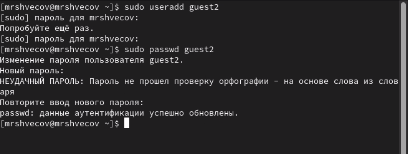
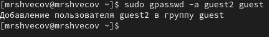
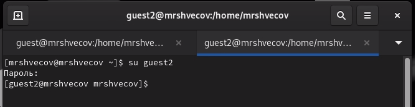
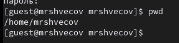
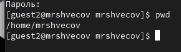
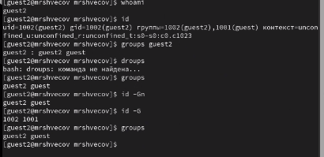
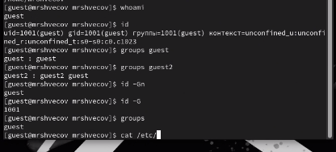
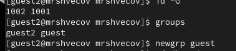
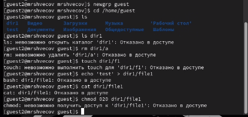

# Содержание {#содержание .TOC-Heading}

[1 Цель работы [1](#цель-работы)](#цель-работы)

[2 Задание [1](#задание)](#задание)

[3 Теоретическое введение
[1](#теоретическое-введение)](#теоретическое-введение)

[4 Выполнение лабораторной работы
[2](#выполнение-лабораторной-работы)](#выполнение-лабораторной-работы)

[4.1 Заполнение таблицы 3.1
[5](#заполнение-таблицы-3.1)](#заполнение-таблицы-3.1)

[4.2 Заполнение таблицы 3.2
[8](#заполнение-таблицы-3.2)](#заполнение-таблицы-3.2)

[5 Выводы [9](#выводы)](#выводы)

[6 Список литературы. Библиография
[9](#список-литературы.-библиография)](#список-литературы.-библиография)

# 1 Цель работы

Получить практические навыки работы в консоли с атрибутами файлов для
групп пользователей.

# 2 Задание

1.  Создание пользователя guest2, добавление его в группу пользователей
    guest
2.  Заполнение таблицы 3.1
3.  Заполнение таблицы 3.2 на основе таблицы 3.1.

# 3 Теоретическое введение

**Права доступа** определяют, какие действия конкретный пользователь
может или не может совершать с определенным файлами и каталогами. С
помощью разрешений можно создать надежную среду --- такую, в которой
никто не может поменять содержимое ваших документов или повредить
системные файлы. \[1\]

**Группы пользователей Linux** кроме стандартных root и users, здесь
есть еще пару десятков групп. Это группы, созданные программами, для
управления доступом этих программ к общим ресурсам. Каждая группа
разрешает чтение или запись определенного файла или каталога системы,
тем самым регулируя полномочия пользователя, а следовательно, и
процесса, запущенного от этого пользователя. Здесь можно считать, что
пользователь - это одно и то же что процесс, потому что у процесса все
полномочия пользователя, от которого он запущен. \[2\]

-   daemon - от имени этой группы и пользователя daemon запускаютcя
    сервисы, которым необходима возможность записи файлов на диск.
-   sys - группа открывает доступ к исходникам ядра и файлам - include
    сохраненным в системе
-   sync - позволяет выполнять команду /bin/sync
-   games - разрешает играм записывать свои файлы настроек и историю в
    определенную папку
-   man - позволяет добавлять страницы в директорию /var/cache/man
-   lp - позволяет использовать устройства параллельных портов
-   mail - позволяет записывать данные в почтовые ящики /var/mail/
-   proxy - используется прокси серверами, нет доступа записи файлов на
    диск
-   www-data - с этой группой запускается веб-сервер, она дает доступ на
    запись /var/www, где находятся файлы веб-документов
-   list - позволяет просматривать сообщения в /var/mail
-   nogroup - используется для процессов, которые не могут создавать
    файлов на жестком диске, а только читать, обычно применяется вместе
    с пользователем nobody.
-   adm - позволяет читать логи из директории /var/log
-   tty - все устройства /dev/vca разрешают доступ на чтение и запись
    пользователям из этой группы
-   disk - открывает доступ к жестким дискам /dev/sd\* /dev/hd\*, можно
    сказать, что это аналог рут доступа.
-   dialout - полный доступ к серийному порту
-   cdrom - доступ к CD-ROM
-   wheel - позволяет запускать утилиту sudo для повышения привилегий
-   audio - управление аудиодрайвером
-   src - полный доступ к исходникам в каталоге /usr/src/
-   shadow - разрешает чтение файла /etc/shadow
-   utmp - разрешает запись в файлы /var/log/utmp /var/log/wtmp
-   video - позволяет работать с видеодрайвером
-   plugdev - позволяет монтировать внешние устройства USB, CD и т д
-   staff - разрешает запись в папку /usr/local

# 4 Выполнение лабораторной работы

1.  Пользователь guest был создан в лабораторной работе №2, поэтому в
    этой лабораторной работе его не создаем заново
2.  Пароль для пользователя guest тоже был задан в лабораторной работе
    №2.
3.  С правами администратора создаю пользователя guest с помощью команды
    `use``radd`, далее с помощью команды `passwd` задаю пароль
    пользователю (рис. 1).

{width="4.25in" height="1.6041666666666667in"}

Создание пользователя

4.  Добавляю пользователя guest2 в группу guest (рис. 2).

{width="2.8020833333333335in"
height="0.3854166666666667in"}

Добавление пользователя в группу

5.  Зашла на двух разных консолях от имени двух разных пользователей с
    помощью команды `su <имя пользователя>` (рис. 3).

{width="4.322916666666667in"
height="1.1145833333333333in"}

Вход в терминал от имени другого пользователя

6.  Проверяю путь директории, в которой я нахожусь с помощью `pwd`.

Проверка для пользователя guest (рис. 4).

{width="1.8645833333333333in"
height="0.4479166666666667in"}

Текущая директория для guest

Проверка для пользователя guest2 (рис. 5).

{width="1.8854166666666667in"
height="0.5416666666666666in"}

Текущая директория для guest2

Стоит отметить, что вход в терминал от имени пользователей был выполнен
в домашней директории пользователя evdvorkina, которую команда `pwd`
вывела. Домашней директорией пользователей она не является. Текущая
директория с приглашением командной строки совпадает.

7.  Проверяю имя пользователей с поомощью команды whoami, с помощью
    команды id могу увидеть группы, к которым принадлежит пользователь и
    коды этих групп (gid), команда groups просто выведет список групп, в
    которые входит пользователь.

id -Gn - выведет названия групп, которым принадлежит пользователь

id -G - выведет только код групп, которым принадлежит пользователь.

Проверка для пользователя guest2 (рис. 6).

{width="4.270833333333333in"
height="2.0729166666666665in"}

Информация о пользователе guest2

Проверка для пользователя guest (рис. 7).

{width="4.333333333333333in" height="1.96875in"}

Информация о пользователе guest

Пользователь guest2 входит в две группы пользователей: в группу guest,
потому что я сама его туда добавила, и в группу guest2, которая
создалась автоматически при создании пользователя.

8.  Вывела интересующее меня содержимое файла etc/group, видно, что в
    группе guest два пользователя, а в группе guest2 один (рис. 8).

{width="3.7708333333333335in"
height="0.4166666666666667in"}

Содержимое файла etc/group

9.  От имени пользователя guest2 регистрирую его в группе guest с
    помощью команды `ne``wgrp` (рис. 9).

{width="2.4583333333333335in" height="0.53125in"}

Регистрация пользователя в группе

10. Добавляю права на чтение, запись и исполнение группе пользвателей
    guest (guest, guest2) на директорию home/guest в которой находятся
    все файлы для последующей работы (рис. 10).

{width="3.0924365704286965in"
height="0.5882349081364829in"}

Изменение прав директории

11. От имени пользователя guest снимаю все атрибуты с директории dir1,
    созданной в предыдущей лабораторной работе. Проверяю, что права
    действительно сняты (рис. 11).

{width="4.302083333333333in"
height="2.0416666666666665in"}

Изменение прав директории

## 4.1 Заполнение таблицы 3.1

Далее проверяю как пользователь guest2 будет взаимодействовать с файлами
в этой директории (рис. 12).

{width="4.302083333333333in"
height="2.0416666666666665in"}

Пример заполнения таблицы 3.1

  --------------------------------------------------------------------------------------------------------------------------------------
  Права директории    Права файла         Создание   Удаление   Запись в Чтение   Смена        Просмотр     Переименование   Смена
                                          файла      файла      файл     файла    директории   файлов в     файл             атрибутов
                                                                                               директории                    файла
  ------------------- ------------------- ---------- ---------- -------- -------- ------------ ------------ ---------------- -----------
  `d-------— (000)`   `--------— (000)`   \-         \-         \-       \-       \-           \-           \-               \-

  `d-----x-— (010)`   `--------— (000)`   \-         \-         \-       \-       \-           \-           \-               \+

  `d----w--— (020)`   `--------— (000)`   \-         \-         \-       \-       \-           \-           \-               \-

  `d----wx-— (030)`   `--------— (000)`   \+         \+         \-       \-       \+           \-           \+               \+

  `d---r---— (040)`   `--------— (000)`   \-         \-         \-       \-       \-           \+           \-               \-

  `d---r-x-— (050)`   `--------— (000)`   \-         \-         \-       \-       \+           \+           \-               \+

  `d---rw--— (060)`   `--------— (000)`   \-         \-         \-       \-       \-           \+           \-               \-

  `d---rwx-— (070)`   `--------— (000)`   \+         \+         \-       \-       \+           \+           \+               \+

  `d-------— (000)`   `------x-— (010)`   \-         \-         \-       \-       \-           \-           \-               \-

  `d-----x-— (010)`   `------x-— (010)`   \-         \-         \-       \-       \-           \-           \-               \+

  `d----w--— (020)`   `------x-— (010)`   \-         \-         \-       \-       \-           \-           \-               \-

  `d----wx-— (030)`   `------x-— (010)`   \+         \+         \-       \-       \+           \-           \+               \+

  `d---r---— (040)`   `------x-— (010)`   \-         \-         \-       \-       \-           \+           \-               \-

  `d---r-x-— (050)`   `------x-— (010)`   \-         \-         \-       \-       \+           \+           \-               \+

  `d---rw--— (060)`   `------x-— (010)`   \-         \-         \-       \-       \-           \+           \-               \-

  `d---rwx-— (070)`   `------x-— (010)`   \+         \+         \-       \-       \+           \+           \+               \+

  `d-------— (000)`   `-----w--— (020)`   \-         \-         \-       \-       \-           \-           \-               \-

  `d-----x-— (010)`   `-----w--— (020)`   \-         \-         \+       \-       \-           \-           \-               \+

  `d----w--— (020)`   `-----w--— (020)`   \-         \-         \-       \-       \-           \-           \-               \-

  `d----wx-— (030)`   `-----w--— (020)`   \+         \+         \+       \-       \+           \-           \+               \+

  `d---r---— (040)`   `-----w--— (020)`   \-         \-         \-       \-       \-           \+           \-               \-

  `d---r-x-— (050)`   `-----w--— (020)`   \-         \-         \+       \-       \+           \+           \-               \+

  `d---rw--— (060)`   `-----w--— (020)`   \-         \-         \-       \-       \-           \+           \-               \-

  `d---rwx-— (070)`   `-----w--— (020)`   \+         \+         \+       \-       \+           \+           \+               \+

  `d-------— (000)`   `-----wx-— (030)`   \-         \-         \-       \-       \-           \-           \-               \-

  `d-----x-— (010)`   `-----wx-— (030)`   \-         \-         \+       \-       \-           \-           \-               \+

  `d----w--— (020)`   `-----wx-— (030)`   \-         \-         \-       \-       \-           \-           \-               \-

  `d----wx-— (030)`   `-----wx-— (030)`   \+         \+         \+       \-       \+           \-           \+               \+

  `d---r---— (040)`   `-----wx-— (030)`   \-         \-         \-       \-       \-           \+           \-               \-

  `d---r-x-— (050)`   `-----wx-— (030)`   \-         \-         \+       \-       \+           \+           \-               \+

  `d---rw--— (060)`   `-----wx-— (030)`   \-         \-         \-       \-       \-           \+           \-               \-

  `d---rwx-— (070)`   `-----wx-— (030)`   \+         \+         \+       \-       \+           \+           \+               \+

  `d-------— (000)`   `----r---— (040)`   \-         \-         \-       \-       \-           \-           \-               \-

  `d-----x-— (010)`   `----r---— (040)`   \-         \-         \-       \+       \+           \-           \-               \+

  `d----w--— (020)`   `----r---— (040)`   \-         \-         \-       \-       \-           \-           \-               \-

  `d----wx-— (030)`   `----r---— (040)`   \+         \+         \-       \+       \+           \-           \+               \+

  `d---r---— (040)`   `----r---— (040)`   \-         \-         \-       \-       \-           \+           \-               \-

  `d---r-x-— (050)`   `----r---— (040)`   \-         \-         \-       \+       \+           \+           \-               \+

  `d---rw--— (060)`   `----r---— (040)`   \-         \-         \-       \-       \-           \+           \-               \-

  `d---rwx-— (070)`   `----r---— (040)`   \+         \+         \-       \+       \+           \+           \+               \+

  `d-------— (000)`   `----r-x-— (050)`   \-         \-         \-       \-       \-           \-           \-               \-

  `d-----x-— (010)`   `----r-x-— (050)`   \-         \-         \-       \+       \+           \-           \-               \+

  `d----w--— (020)`   `----r-x-— (050)`   \-         \-         \-       \-       \-           \-           \-               \-

  `d----wx-— (030)`   `----r-x-— (050)`   \+         \+         \-       \+       \+           \-           \+               \+

  `d---r---— (040)`   `----r-x-— (050)`   \-         \-         \-       \-       \-           \+           \-               \-

  `d---r-x-— (050)`   `----r-x-— (050)`   \-         \-         \-       \+       \+           \+           \-               \+

  `d---rw--— (060)`   `----r-x-— (050)`   \-         \-         \-       \-       \-           \+           \-               \-

  `d---rwx-— (070)`   `----r-x-— (050)`   \+         \+         \-       \+       \+           \+           \+               \+

  `d-------— (000)`   `----rw--— (060)`   \-         \-         \-       \-       \-           \-           \-               \-

  `d-----x-— (010)`   `----rw--— (060)`   \-         \-         \+       \+       \-           \-           \-               \+

  `d----w--— (020)`   `----rw--— (060)`   \-         \-         \-       \-       \-           \-           \-               \-

  `d----wx-— (030)`   `----rw--— (060)`   \+         \+         \+       \+       \+           \-           \+               \+

  `d---r---— (040)`   `----rw--— (060)`   \-         \-         \-       \-       \-           \+           \-               \-

  `d---r-x-— (050)`   `----rw--— (060)`   \-         \-         \+       \+       \+           \+           \-               \+

  `d---rw--— (060)`   `----rw--— (060)`   \-         \-         \-       \-       \-           \+           \-               \-

  `d---rwx-— (070)`   `----rw--— (060)`   \+         \+         \+       \+       \+           \+           \+               \+

  `d-------— (000)`   `----rwx-— (070)`   \-         \-         \-       \-       \-           \-           \-               \-

  `d-----x-— (010)`   `----rwx-— (070)`   \-         \-         \+       \+       \+           \-           \-               \+

  `d----w--— (020)`   `----rwx-— (070)`   \-         \-         \-       \-       \-           \-           \-               \-

  `d----wx-— (030)`   `----rwx-— (070)`   \+         \+         \+       \+       \+           \-           \+               \+

  `d---r---— (040)`   `----rwx-— (070)`   \-         \-         \-       \-       \-           \+           \-               \-

  `d---r-x-— (050)`   `----rwx-— (070)`   \-         \-         \+       \+       \+           \+           \-               \+

  `d---rw--— (060)`   `----rwx-— (070)`   \-         \-         \-       \-       \-           \+           \-               \-

  `d---rwx-— (070)`   `----rwx-— (070)`   \+         \+         \+       \+       \+           \+           \+               \+
  --------------------------------------------------------------------------------------------------------------------------------------

Таблица 3.1 «Установленные права и разрешённые действия для групп»

## 4.2 Заполнение таблицы 3.2

На основе таблицы 3.1 заполняю таблицу 3.2.

  -----------------------------------------------------------------------
  Операция             Права на директорию         Права на файл
  -------------------- --------------------------- ----------------------
  Создание файла       `d----wx-— (030)`           `--------— (000)`

  Удаление файла       `d----wx-— (030)`           `--------— (000)`

  Чтение файла         `d-----x-— (010)`           `----r---— (040)`

  Запись в файл        `d-----x-— (010)`           `-----w--— (020)`

  Переименование файла `d----wx-— (030)`           `--------— (000)`

  Создание             `d----wx-— (030)`           `--------— (000)`
  поддиректории                                    

  Удаление             `d----wx-— (030)`           `--------— (000)`
  поддиректории                                    
  -----------------------------------------------------------------------

Таблица 3.2 «Минимальные права для совершения операций от имени
пользователей входящих в группу»

# 5 Выводы

Были получены практические навыки работы в консоли с атрибутами файлов
для групп пользователей

# 6 Список литературы. Библиография

\[0\] Методические материалы курса

\[1\] Права доступа:
https://codechick.io/tutorials/unix-linux/unix-linux-permissions

\[2\] Группы пользователей:
https://losst.pro/gruppy-polzovatelej-linux#Что_такое_группы
